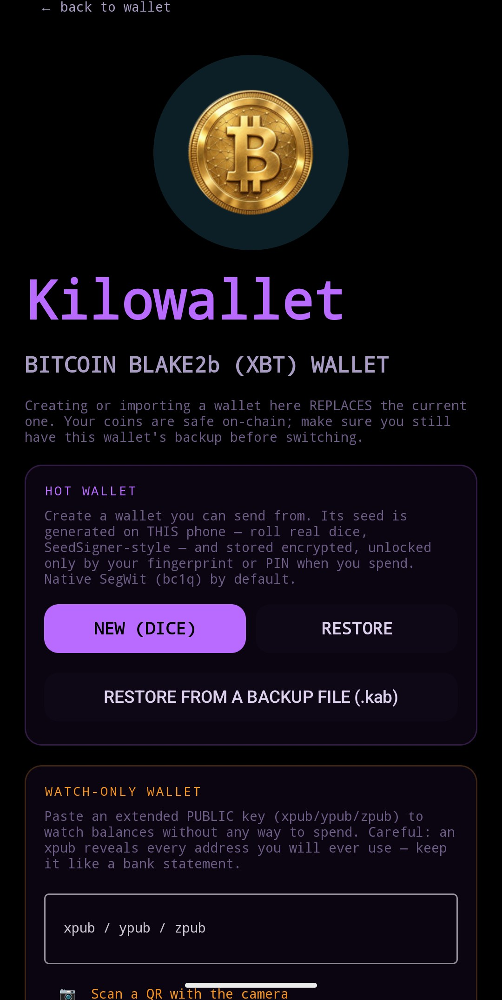
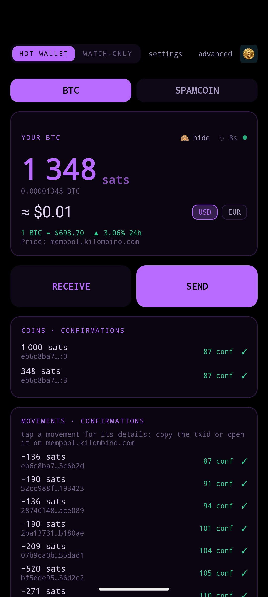
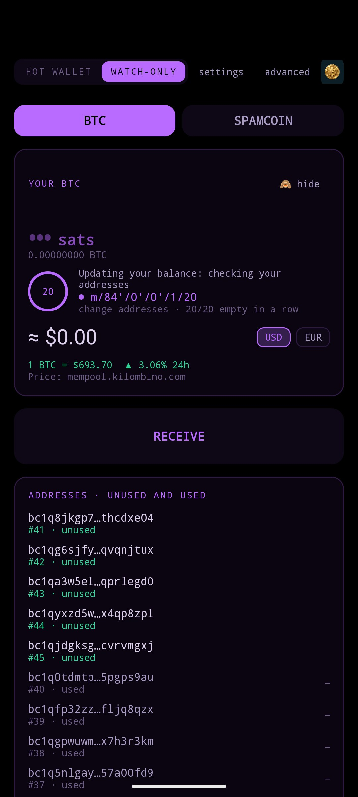
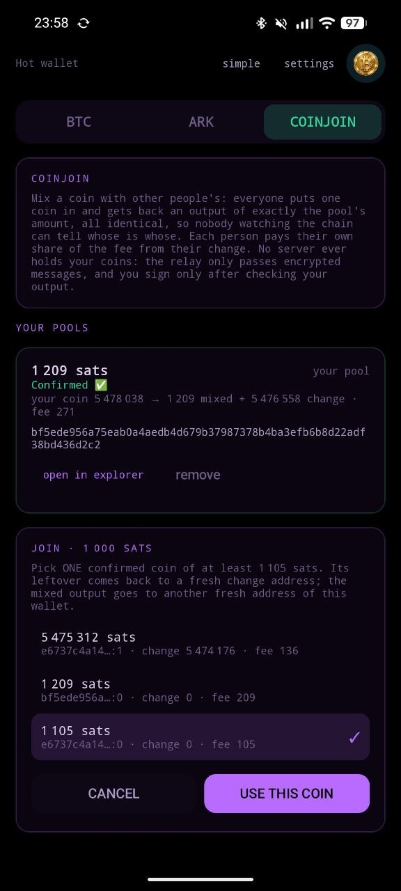
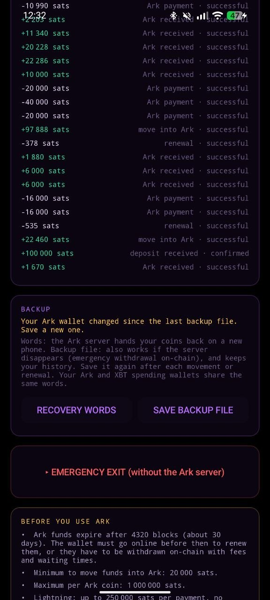
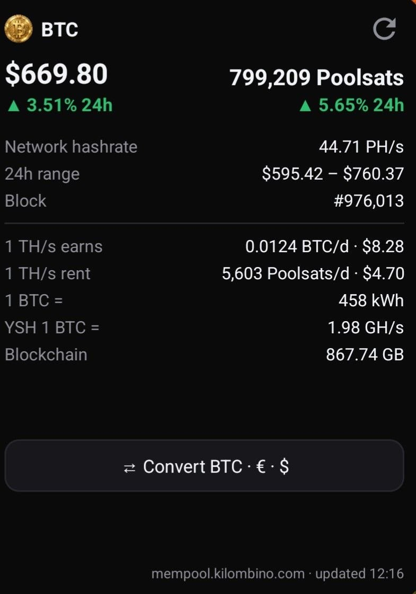
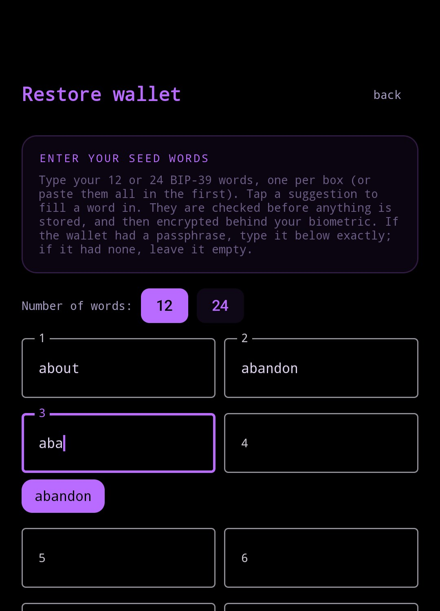
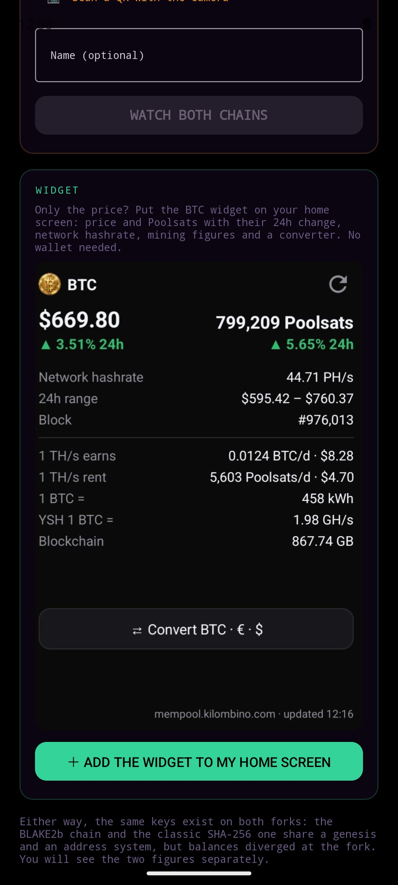
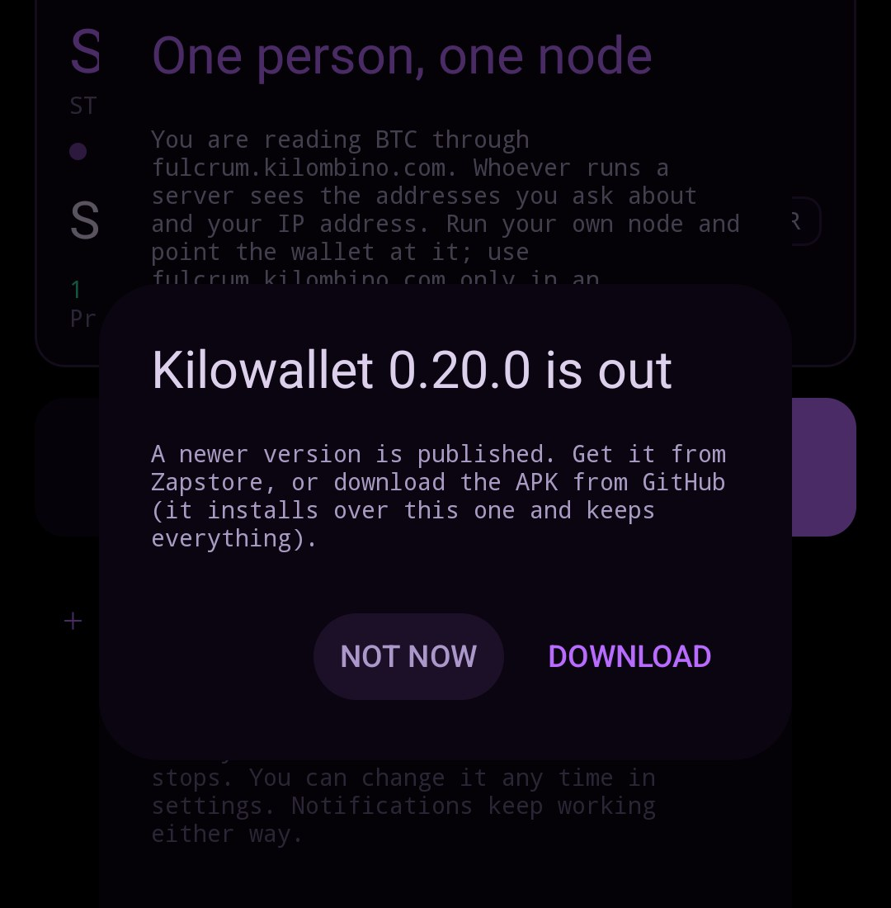
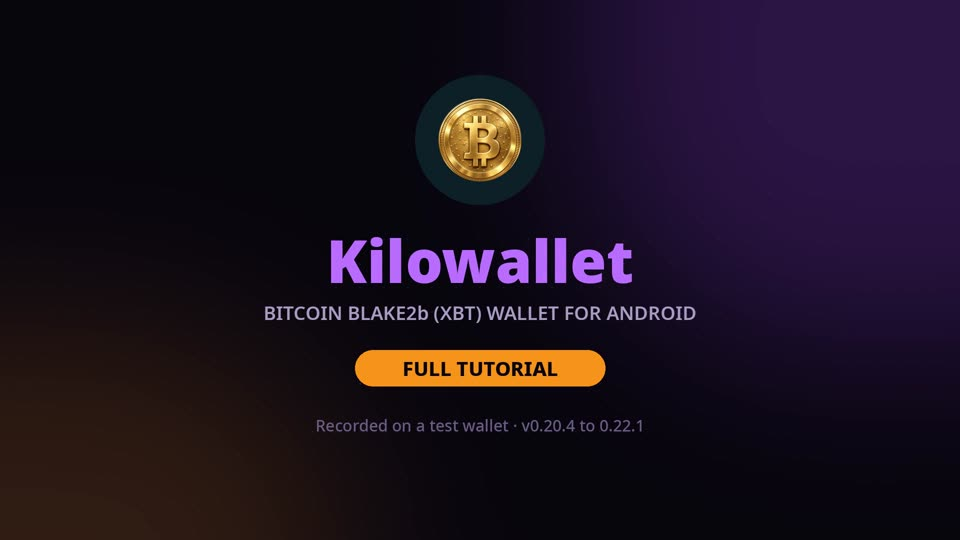

<p align="center"></p>

# Kilowallet

Kilombino's Bitcoin BLAKE2b (XBT) wallet, formerly "Kilombino Bitcoin-Blake2b wallet".

<p align="center">
  
  
  
</p>
<p align="center">
  
  
  
</p>
<p align="center">
  
  
  
</p>

<p align="center">
  <a href="https://github.com/Kilombino/kilowallet/releases/download/tutorial/kilowallet_tutorial_EN.mp4"></a><br>
  ▶ <b><a href="https://github.com/Kilombino/kilowallet/releases/download/tutorial/kilowallet_tutorial_EN.mp4">Video tutorial</a></b> (13 min, English) · <a href="https://github.com/Kilombino/kilowallet/releases/tag/tutorial">chapters and subtitles</a>
</p>


A Bitcoin wallet for Android for **both sides of the BLAKE2b fork at once**. Watch any
extended *public* key across the BLAKE2b chain and the classic SHA-256 chain side by
side, or create a spending wallet whose seed is generated on-device and never leaves it.

Built for GrapheneOS: no Google Play Services, no push server, no analytics, no
account. Apache-2.0, reproducible, and every line of cryptography is in this repo.

---

## What it does

- **Watch or spend.** Import an xpub to watch read-only, or create a spending (hot)
  wallet: its seed is generated on the phone — roll physical dice, SeedSigner-style, or
  use the secure RNG — and stored encrypted behind an Android Keystore key that needs
  your fingerprint or device PIN to sign. Native SegWit (bc1q) by default.
- **Sweep a private key.** Paste or scan a WIF key (paper wallet, another wallet's export)
  and move all its coins into this wallet in one transaction, after seeing the fee: legacy
  (1…), nested SegWit (3…), native SegWit (bc1q…) and Taproot (bc1p…), compressed or
  uncompressed keys. Signed byte for byte as Bitcoin Knots signs, unified sighash on BLAKE2b.
- **Rescue XBT from a pre-fork LND seed** (Settings, Advanced). Type the 24 aezeed words
  (and passphrase) of a Lightning node created before the fork: its on-chain coins on
  BLAKE2b (BIP-84/49/86 wallet and channel payment keys) are swept with the unified
  sighash, which the SHA-256 chain rejects, so the same node there is untouched.
  Cooperative channel closes it made on SHA-256 after the fork can be replayed on BLAKE2b
  to free your share; nothing but a channel close is ever replayed. Load the node's
  channel.backup too and every channel is listed with its state on both chains, the
  anchor outputs a peer's force close paid you are found, and your delayed output of a
  force close you made is rebuilt from the seed and the backup and swept once its CSV
  delay has passed.
- **Optional BIP-39 passphrase.** When creating or restoring a wallet you can add a
  passphrase ("25th word"); leave it empty for none. The app shows the wallet's
  fingerprint, the same one Sparrow and SeedSigner show, so you can check you typed it
  right. Ark uses the same words and passphrase.
- **Both chains, one key.** BLAKE2b and SHA-256 share a genesis block and Bitcoin's
  whole address scheme — the fork changed the proof-of-work, not key derivation — so
  the same xpub is meaningful on both, and the balances diverge at the fork.
- **xpub, ypub or zpub.** Legacy, wrapped SegWit and native SegWit, detected from the
  SLIP-132 version bytes and explained in the UI.
- **Your own node.** The BLAKE2b side can point at any Electrum server you run.
- **Balance-change notifications** without a push server: the phone asks the Electrum
  server itself, on a visible foreground service you opt into.
- **Simple or Advanced.** On first open you choose. *Simple* is one screen: your XBT
  balance with its value in USD or EUR, and Send / Receive. *Advanced* is everything
  below. Switch at any time from the top of the wallet.
- **XBT price widget.** A home-screen widget (formerly the separate XBT Widget app) with
  the XBT price, the ratio in Poolsats, the 24h range and the block height; at four rows
  tall it adds what 1 TH/s earns and costs to rent, kWh per XBT, YSH and chain size.
- **Ark (coming).** The Simple screen already has an Ark tab with the real limits of the
  Paperclip Ark server, so they are read before any money goes in.
- **Open a movement in a block explorer.** In Advanced mode, tap a movement and the
  wallet asks whether to open it on mempool.kilombino.com (or the SHA-256 twin). Each
  chain's explorer is configurable in Settings, like its Electrum server.
- **It explains itself.** The scan is narrated — derivation paths tick past, and the
  gap limit is drawn as a ring that fills and resets — so you can watch how a wallet
  actually finds your coins instead of staring at a spinner.

## Prices

Prices and mining figures come from one public endpoint,
`https://mempool.kilombino.com/api/v1/blake2b/widget`, which only uses public sources
(the node, Neoxa, MiningRigRentals, Kraken). The wallet asks at most every 15 minutes,
obeys the server's `pollMinutes` and `Retry-After`, and backs off on errors. Without it
the wallet works exactly the same, just without fiat values. No WorkManager or other new
dependency was added: the widget refreshes from Android's own widget updates and the
existing balance watcher.

## Default servers

| Chain | Server | Software |
|---|---|---|
| BLAKE2b | `fulcrum.kilombino.com:17717` | Fulcrum 2.1.2 |
| SHA-256 | `nobip110fulcrum.kilombino.com:50002` | Frigate 1.5.2 |

Both are TLS with **self-signed certificates**, which is normal for Electrum servers
and means CA validation would be meaningless. Instead the app pins: it remembers the
SHA-256 fingerprint it saw first, and if the certificate ever changes it says so and
refuses to continue until you accept the new one deliberately.

The SHA-256 side is a lookup service — find your coins with an xpub — so it does not
offer a custom node. The BLAKE2b side does.

## Security posture

**A watch-only wallet holds no secrets; a hot wallet holds exactly one.** Several
decisions follow:

- In watch-only mode there is no key to leak. In hot mode the only secret is the seed,
  encrypted with an Android Keystore key created with `setUserAuthenticationRequired(true)`
  — the fingerprint/PIN is bound to the decryption cipher, not a screen the app could skip.
- The xpub lives in ordinary app-private storage, not `EncryptedSharedPreferences`.
  Encrypting a non-secret would buy nothing but a dependency on
  `androidx.security:security-crypto`, which is both an alpha and deprecated.
  `allowBackup=false` keeps it off cloud backups; the app sandbox does the rest.
- An xpub **is** privacy-sensitive — it reveals every address you will ever use — and
  the app says so on the first screen.

## Cryptography

There is no crypto dependency in this project. No BouncyCastle, no bdk, no
secp256k1 JNI. All of it is Kotlin in `app/src/main/java/.../crypto/`:

| Piece | Why it is in-tree |
|---|---|
| `Secp256k1.kt` | secp256k1 curve arithmetic. `Ecdsa.kt` adds signing with RFC-6979 deterministic nonces (no reused/biased `k`), low-S, DER — pinned to the BIP-143 worked example so a wrong signature can never ship. Watch-only mode still touches only the public half. |
| `Ripemd160.kt` | Android ships no RIPEMD-160, and HASH160 needs it. ~120 lines of fully specified, deterministic code with published vectors. |
| `Base58.kt`, `Bech32.kt` | Small, exactly specified encodings. |
| `Bip32.kt` | Public derivation only — there is deliberately no CKDpriv. |

Correctness is pinned by `app/src/test/.../CryptoTest.kt`: the RIPEMD-160
specification vectors, the published BIP-49 and BIP-84 account vectors, and an
Electrum scripthash confirmed against both live servers.

```
./gradlew :app:testDebugUnitTest
```

## Build

```
./gradlew :app:assembleRelease
```

See [PUBLISHING.md](PUBLISHING.md) to cut a signed release, and
[README-REPRODUCIBLE.md](README-REPRODUCIBLE.md) to rebuild the published APK and
check it byte-for-byte.

## Licence

Apache-2.0. See [LICENSE](LICENSE).
